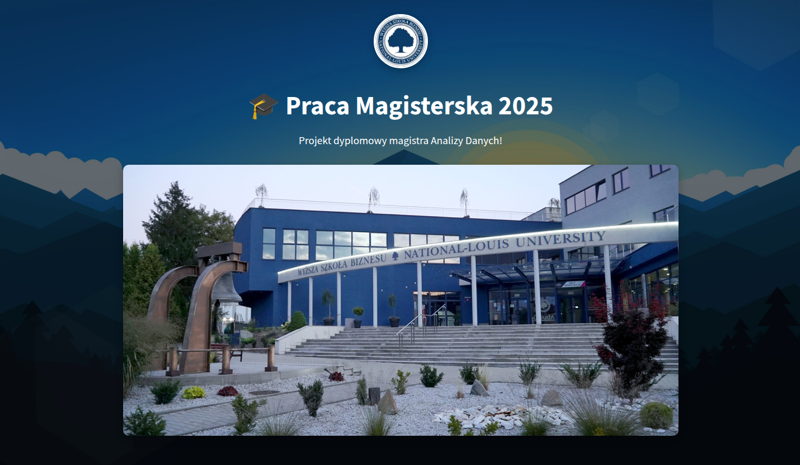

# Ukrainian Automotive Market Analysis (2017–2023)

## Project Overview

This project is a full-scale analytical web application developed as a Master's diploma thesis in Data Analysis.  
It is designed to explore, model, and interpret structural changes in the Ukrainian automotive market between 2017 and 2023 using real-world registry data.

The system combines a reproducible ETL pipeline, statistical modeling, and an interactive Shiny-based analytical interface.  
It is not a demonstrational dashboard, but a data-driven analytical platform integrating data engineering, applied statistics, and interactive visualization.

The application is publicly available at:  
https://statauto.net

---

## Academic Context

This project was developed as a Master's thesis within the **Data Analysis program (WSB-NLU, 2025)**.

**Academic objectives:**
- apply modern analytical methods to large-scale real data,
- demonstrate the full analytical lifecycle (ETL → analysis → modeling → interpretation),
- evaluate the impact of structural shocks (COVID-19, war) on transport market indicators,
- ensure analytical reproducibility and methodological awareness.

The work was supervised as part of an academic research process and evaluated as a diploma-level analytical system.

---

## Problem Statement

The Ukrainian automotive market underwent significant structural changes between 2017 and 2023, driven by:
- economic cycles,
- the COVID-19 pandemic,
- the full-scale war starting in 2022.

Key analytical challenges addressed in this project include:
- identifying long-term and short-term trends in vehicle registrations,
- distinguishing structural breaks from regular fluctuations,
- assessing changes in vehicle age, fuel types, ownership structure, and categories,
- evaluating the reliability and consistency of registry data after 2022,
- forecasting future registrations under uncertainty.

Standard linear approaches often fail under such conditions, requiring careful data validation and time-series modeling.

---

## Data Sources

The analysis is based on public, real-world datasets, including:

- Ukrainian open government registries (`data.gov.ua`)
- Customs and import-related data (`customs.gov.ua`)

**Data characteristics:**
- period covered: 2017–2023 (forecast extended to 2024–2025),
- original formats: CSV, BSV,
- total raw data volume: approximately 5 GB,
- records include vehicle type, fuel, color, ownership category, registration date, production year, and location.

---

## Methodology & Analysis Pipeline

The project follows a complete analytical lifecycle:

### 1. Data Collection
- ingestion of seven large heterogeneous registry files,
- unification of inconsistent schemas and encodings.

### 2. Data Cleaning & Transformation
- normalization of categorical variables,
- handling missing and inconsistent records,
- date parsing and temporal alignment,
- validation of post-2022 registry field changes.

### 3. ETL & Data Optimization
- implementation of a dedicated ETL process outside the Shiny application,
- construction of a high-dimensional analytical data matrix (~5 GB),
- optimization using `.fst` format (reduction to ~1 GB),
- final persistence as `.rds` files for seamless integration with Shiny.

### 4. Exploratory Data Analysis
- descriptive statistics and aggregation by time, category, and attributes,
- identification of structural breaks and anomalies.

### 5. Modeling & Forecasting
- correlation analysis for temporal and categorical variables,
- linear regression models for trend assessment (with explicit evaluation of limitations),
- ARIMA models for forecasting vehicle registrations in 2024–2025,
- confidence interval estimation and interpretative commentary.

### 6. Visualization & Interpretation
- interactive visual analytics using Plotly and Leaflet,
- narrative explanations integrated directly into the analytical interface.

---

## System Architecture

The system is designed with a clear separation of concerns:

### Data Processing Layer
- standalone ETL scripts,
- data cleaning, aggregation, and feature preparation,
- storage of processed analytical artifacts (`.rds`) outside the UI runtime.

### Analytical Logic Layer
- statistical computations,
- correlation analysis,
- regression and ARIMA modeling,
- data quality validation (including post-2022 structural audits).

### UI Layer (Shiny)
- interactive dashboards and filters,
- user-driven exploration of analytical results,
- visualization-only access to precomputed data,
- no heavy ETL or modeling executed at runtime.

This architecture ensures performance, reproducibility, and analytical transparency.

---

## Technologies & Tools

- **Language:** R  
- **Web Framework:** Shiny  
- **Data Manipulation:** dplyr, tidyr, lubridate, janitor  
- **Visualization:** plotly, ggplot2, leaflet  
- **Modeling:** linear regression, ARIMA  
- **Data Storage:** fst, rds  
- **Cloud Storage:** AWS S3 (secure storage of analytical artifacts)  
- **DevOps & Deployment:** Docker, Docker Compose  
- **CI/CD:** GitHub Actions  
- **Hosting:** Hetzner Cloud, Nginx reverse proxy, SSL  

---

## Key Features of the Application

- interactive exploration of vehicle registrations (new and used),
- analysis by fuel type, vehicle category, age, brand, and ownership,
- temporal analysis across multiple market phases,
- explicit handling of registry inconsistencies after 2022,
- built-in forecasting with confidence intervals,
- scalable architecture supporting concurrent users,
- reproducible analytical workflow decoupled from the UI.

---

## Analytical Value & Insights

The project demonstrates that:
- linear trend models are insufficient in the presence of structural breaks,
- registry data quality significantly changes after systemic shocks,
- time-series models (ARIMA) provide more robust short-term forecasts,
- analytical conclusions must be interpreted together with data reliability constraints,
- separation of ETL and UI layers is critical for scalable analytical systems.

The system serves as a practical example of applied analytics under real-world uncertainty.

---

## Limitations & Future Work

**Current limitations:**
- incomplete or altered registry fields after 2022,
- lack of fully consistent identifiers for certain vehicle categories,
- forecasts remain sensitive to future structural shocks.

**Planned extensions:**
- integration of structural break and intervention models,
- automated data quality monitoring,
- extension of the dataset with post-2023 records,
- additional robustness checks using alternative time-series methods,
- further optimization of analytical pipelines.

---

## Repository

Source code and technical documentation are maintained in a private GitHub repository used for academic evaluation and controlled deployment.
